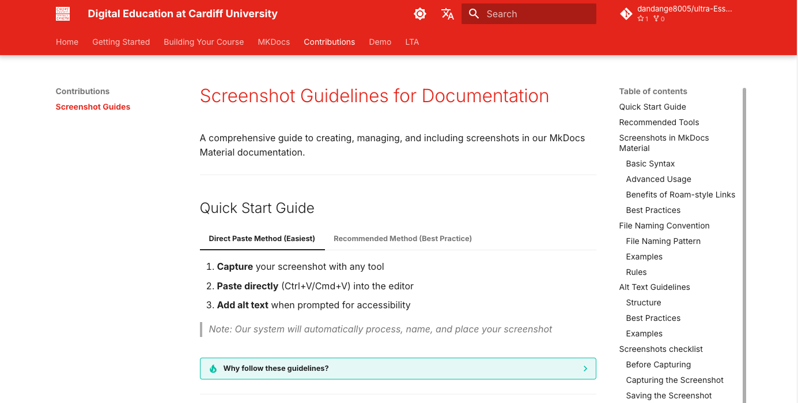

---
tags:
      - accessibility
      - Tag
---

<!-- This is a demo page to showcase the basic markdown syntax supported by MkDocs. You can use this page as a reference when creating your own documentation. -->

# Demo page

## Basic Markdown syntax

This is a paragraph with some **bold text** and some *italicized text*. You can also use ***bold and italics together*** for stronger emphasis. For code snippets, use `inline code` with backticks. To ~~strike through~~ text, use tildes. Create [links](https://example.com "Optional Title") easily, and even use  for images.

## Lists and blockquotes

> For blockquotes, use the greater than sign.

Ordered lists:

1. First item
2. Second item
      - Nested unordered item
      - Another nested item

Unordered lists:

- First item
- Second item
      1. Nested unordered item
      2. Another nested item

Images:

Tables:

| Header 1 | Header 2 |
|----------|----------|
| Cell 1   | Cell 2   |

Links to other pages:

For example, I want to write a paragraph about the benefits of using markdown files and introduce some [basic markdown syntax](basic-markdown.md). I can also create a list of items that link to the mkdocs pages:

- [Another demo page](demo2.md)

## Buttons and callouts

[Regular button](#){.md-button}
[Primary button](#){.md-button .md-button--primary}

!!! note "Note"
    Use for general information and neutral observations.

!!! info "Info"
    Perfect for additional context and background information.

!!! abstract "Abstract"
    Ideal for summaries and high-level overviews.

## Grid layouts

-   

    __Image Card 1__
    
    Description for image 1

-   

    __Image Card 2__
    
    Description for image 2

## Videos

Vimeo video

Panopto video

## Tabs

=== ":material-microsoft: Windows"
    Windows-specific instructions...

=== ":material-apple: iOS"
    iOS-specific instructions...

=== ":octicons-browser-16: Web"
    Web platform instructions...

<!-- 

## Text formatting

This **bold text** and this *italicized text* show emphasis, while ***bold and italics together*** create stronger emphasis. You can also use __underscores__ for **bold** and _italics_. For code snippets, use `inline code` with backticks. To ~~strike through~~ text, use tildes. Create [links](https://example.com "Optional Title") easily, and even use  for images.

## Lists and blockquotes

> for blockquotes, 

and separate paragraphs with blank lines. Create ordered lists:

1. First item
2. Second item
      - Nested unordered item
      - Another nested item

For horizontal rules, use three hyphens, asterisks, or underscores:

---

For more complex formatting, use `superscript` or `subscript`, and tables:

| Header 1 | Header 2 |
|----------|----------|
| Cell 1   | Cell 2   |

Finally, you can add `#` tags for headings of different levels (H1-H6).

# Heading 1
## Heading 2
### Heading 3

## Inserting images

![[image.png|alt text]]

## Linking to other pages

One of the benefit of using a markdown file is that you can easily link to other pages within the same repository. This is useful for creating a table of contents or linking to related content.

## Linking to other pages

For example, I want to write a paragraph about the benefits of using markdown files and introduce some [basic markdown syntax](basic-markdown.md). I can also create a list of items that link to the mkdocs pages:

- [[buttons]]
- [[icons-emojis]]
- [[callouts]]
 
## keyboard shortcuts

++ctrl+alt+del++
  -->