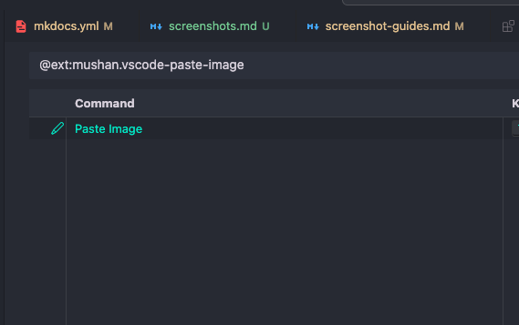

## Comparing png and webp

-  ![[image.png]]

    image.png 146KB

-  ![[image.webp]]
  
    image.webp 53KB
  
- ![[image_800x405.webp]]

    image_800x405.webp 21KB

## Comparing png and avif

-  

    2025-03-07-11-29-09.png 20KB

-  

    2025-03-07-11-29-09.avif 3KB

